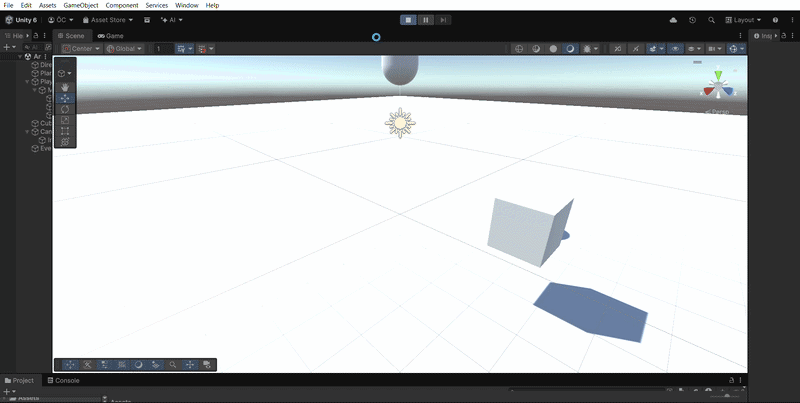

# Paradox Lens | Advanced Spatial Perception Engine

-white?style=for-the-badge&logo=unity)

**Paradox Lens** is a technical study in non-Euclidean geometry and spatial manipulation. It implements complex perspective-shifting mechanics inspired by experimental physics and modern puzzle masterpieces. The project serves as a showcase for high-performance interaction systems and custom rendering pipelines within Unity 6.

---

##  Core Technical Pillars

###  Recursive Perspective Scaling

A robust implementation of dynamic object scaling based on the observer's frustum. Unlike standard scaling, this engine maintains the *perceived volume* of an object through real-time distance-ratio calculations.
- **Mathematical Model:** $S = S_0 \cdot (D/D_0)$ where $S$ is the scale factor and $D$ is the viewport depth.
- **Constraint Solver:** Features a dynamic collision buffer to prevent geometry clipping during rapid scale transitions.

### 📸 Viewfinder Capture & Realization
A high-fidelity snapshot system that captures environmental state into a localized reality.
- **Dynamic Render Projection:** Captures a high-resolution sub-frustum into a unique `RenderTexture` and physicalizes it via an instant object factory.
- **Kinematic Transfer:** Implements momentum-aware release logic, allowing for natural projectile physics and interaction fluidness.

###  Advanced Rendering (Stencil & HLSL)
Custom-built shaders developed to break standard lighting conventions and create spatial paradoxes.
- **Scanline Spatial Tracker:** A world-space HLSL shader that visualizes spatial manipulation through procedural noise and scanline patterns.
- **Stencil-Based Windows:** Implementation of portal logic using stencil buffers for non-Euclidean environmental transitions.

---

##  Engineering Architecture

- **Smooth State Interpolation:** All mechanical transitions (scaling, camera FOV, UI flash) are managed via high-performance interpolation algorithms for a "AAA" game feel.
- **Gravity Bridge:** A custom physics module that decouples gravity vectors from the global environment, enabling per-object directional gravity.
- **Scalable Interaction System:** A decoupled interaction architecture that supports rapid implementation of new perspective-based mechanics.

---

##  Technical Specifications

- **Unity Version:** 6 (6000.0.2f1)
- **Render Pipeline:** Built-in / URP Compatible
- **Core Languages:** C# (Logic), HLSL (Shaders)
- **Physics:** Custom Rigidbody-based Gravity Logic

---

*Authored by [OykuCngz](https://github.com/OykuCngz) — Explorations in Interactive Geometry.*
